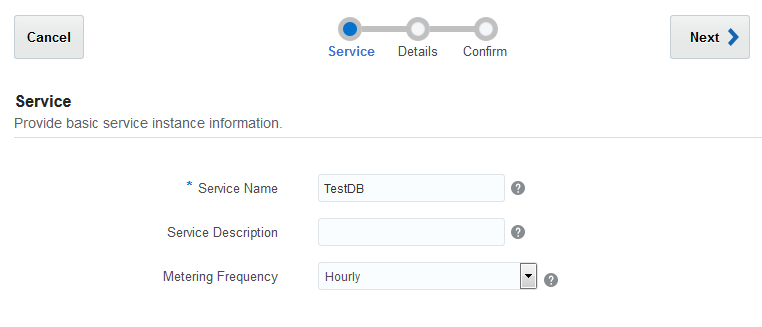
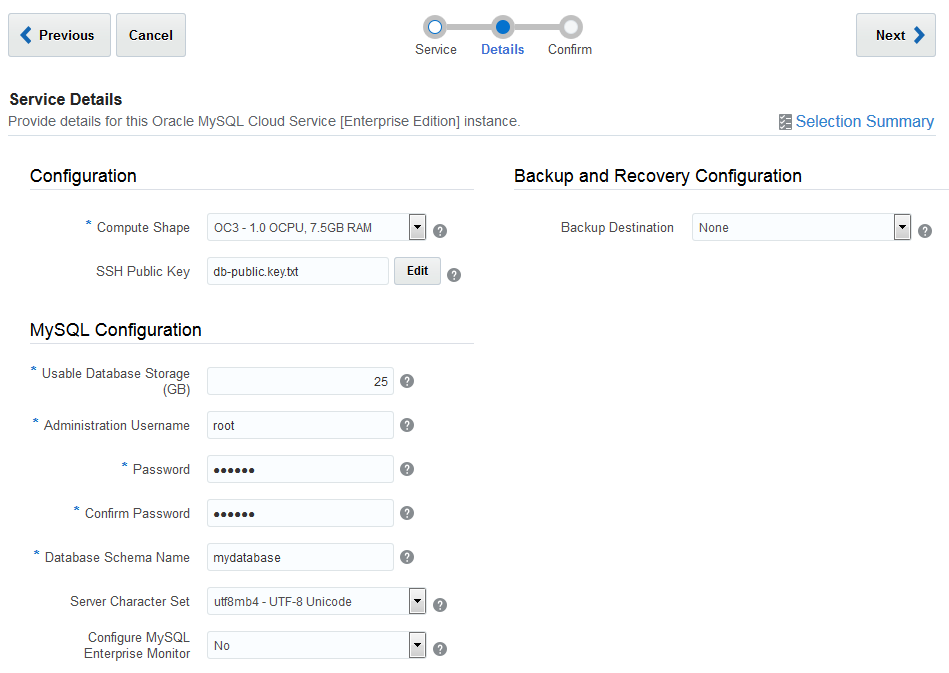
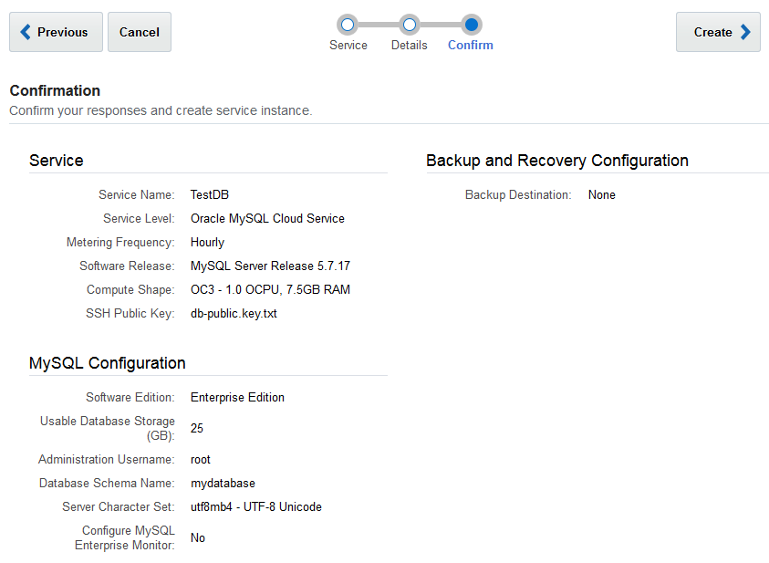

# Creating an Instance of Oracle MySQL Cloud Service

## Before You Begin ##
This Oracle By Example (OBE) lab shows you how to create an Instance of Oracle MySQL Cloud Service.
                            
### Background ###
With Oracle MySQL Cloud Service, you can deploy MySQL servers to the cloud, with each deployment containing a single MySQL server. You have full access to the features and operations available with a MySQL server. To simplify maintenance and management operations, Oracle provides the computing power, physical storage, and tooling.

When you create an instance of Oracle MySQL Cloud Service, you must associate a Secure Shell (SSH) public key with the compute infrastructure supporting the deployment. When you use an SSH client to connect to the instance, you must provide the private key that matches the public key.

### What Do You Need? ###
- An Oracle Cloud account
- [Git](https://git-scm.com/downloads) (Git Bash shell)

## Create an SSH Key Pair ##

1. Open a Git bash command-line window (or terminal in Linux).
2. Generate the SSH key pair: 

<code>ssh-keygen -t rsa -N "<i>passphrase</i>" -b "<i>2048</i>" -C "<i>key comment</i>" -f <i>path/root_name</i></code>

Argument|Description
--------|-----------
`-t rsa`|Use the RSA algorithm
<code>-N "<i>passphrase</i>"</code>|Passphrase to protect the use of the key (like a password). If you don't want to set a passphrase, don't enter anything between the quotation marks. **Note**: Although a passphrase isn't required, you should specify one as a security measure to protect the private key from unauthorized use.
<code>-b "<i>2048</i>"</code>|Generate a 2048-bit key (default). A minimum of 2048 bits is recommended for SSH-2 RSA. 
<code>-C "<i>key commment</i>"</code>|A name to identify the key.
<code>-f <i>path/root_name</i></code>|The location where the key pair is saved and the root name for the files. For example, if you make `id_rsa` the root name, then the name of the private key is `id_rsa`, and the name of the public is `id_rsa.pub`.

## Create an Instance of Oracle MySQL Cloud Service ##

1. Log in to your Oracle Cloud account. Enter your account credentials in the Identity Domain, User Name, and Password fields.
2. Click **Customize Dashboard**.
3. Select **Show** for **MySQL Cloud Service**.
4. Close the **Customize Dashboard** window.
5. On the **MySQL Cloud Service** tile, click the **Action Menu Action Menu** and select **Open Service Console**.
6. If there are no existing services, click the **Services** tab.
7. Click **Create Service**.
8. Enter or select the following information, and then click **Next**:
   * **Service Name**: `TestDB`
   * **Service Description**: (optional)
   * **Metering Frequency:**: Hourly

   
   [Description of the illustration mysql04.png](files/mysql04.txt)

9. Enter or select the following information, and then click **Next**:
   * **Compute Shape: OC3-1.0 OCPU, 7.5GB RAM**
   *  **SSH Public Key** (Enter the public key that you generated in the previous section.)
   * **Usable Database Storage(GB)**: 25
   * **Administration User**: root
   * **Administration Password**
   * **Confirm Administration Password**
   * **Database Schema Name**: `mydatabase`
   * **Server Character Set**: utf8mb4 - UTF-8 Unicode
   * **Configure MySQL Enterprise Monitor**: No
   * **Backup Destination**: None

   
   [Description of the illustration mysql05.png](files/mysql05.txt)  

10. Review the details of your instance and then click **Create**.
   
   [Description of the illustration mysql06.png](files/mysql06.txt) 
11. Wait until the instance is created.
   
   [Description of the illustration mysql06.png](files/mysql07.txt) 

## Want to Learn More? ##

   * [Using Oracle MySQL Cloud Service](http://docs.oracle.com/cloud/latest/mysql-cloud/UOMCS/toc.htm) in the Oracle Help Center
   * [Deploying a PHP Application to Oracle Application Container Cloud Service](https://apexapps.oracle.com/pls/apex/f?p=44785:112:0::::P112_CONTENT_ID:19923) OBE

